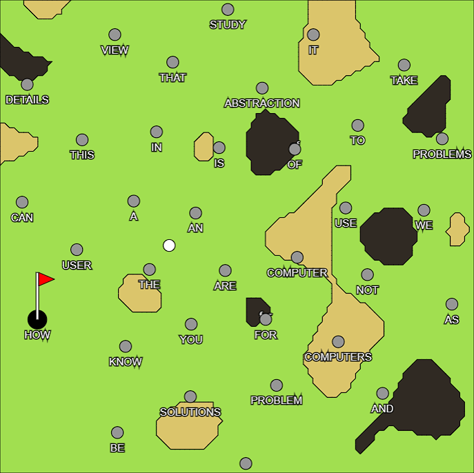
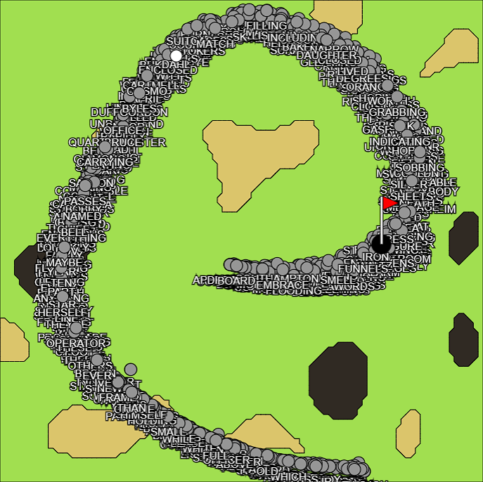
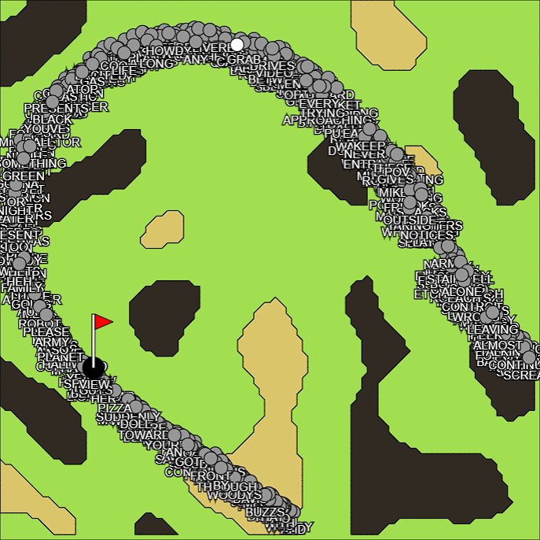

<p align="center">  </p>

# Golfmantle
Golfmantle is a game similar to [Semantle](https://semantle.com/) which uses [Word Embedding](https://en.wikipedia.org/wiki/Word_embedding) to assign words a vector based on their similarity to other words in the corpus. In Golfmantle, players can input a word into the game, and the ball is hit in the general direction of where that word would be in the 2D space.

## Preprocessing
Using the [Gensim Word2Vec](https://radimrehurek.com/gensim/models/word2vec.html) algorithm, a corpus of text is uploaded and processed by our [corpus conversion script](https://github.com/paullu-ualberta/paullu-hip-2022-shared/blob/main/Projects/P02/static/training/word_vector_train.py). The output contains 200 dimensions by default. In order to apply this to a 2D game, these vectors must be reduced. Using [t-SNE](https://scikit-learn.org/stable/modules/generated/sklearn.manifold.TSNE.html), these vectors are reduced from 200 dimensions to 2 dimensions. You can [learn more about how this works](https://youtu.be/NEaUSP4YerM?t=79).

The outputted list of 2D vectors is then converted into a .json file that looks something like this (but much larger):

```json
{
  "ron": [
    50.480621337890625,
    -47.154998779296875
  ],
  "hermione": [
    50.12840270996094,
    -47.17008972167969
  ],
  "dumbledore": [
    53.18267822265625,
    -45.649383544921875
  ]
}
```

The vectors are not calculated while the game runs for performance reasons.

## Game During Runtime
The game is operated by many javascript scripts which calculate collisions and interpret the 2D vectors that were preprocessed.

### Main Corpus
Words are distributed onto the canvas based on their vector positions defined by Word2Vec and t-SNE.


### Interesting Shapes
Some corpora produce interesting shapes when passed through Word2Vec.




### Small Corpora
When corpora don't contain a lot of data, they produce spread out but poor results like this.


## Obstacles
Obstacles are determined using [Perlin Noise](https://en.wikipedia.org/wiki/Perlin_noise) maps. Which allow for convincing and random sand pits and rocks. Some words that are obstructed by these obstacles will appear on the obstacle to help give the player a hint as to what words they are close to.

## Collisions

## Definitions
Definitions are pulled using an API called, [the Free Dictonary API](https://dictionaryapi.dev/). All of the words are checked to ensure that they are actually in the corpus, and then synonyms and antonyms are provided if they are available in the dictonary. Players can click on these synonyms and antonyms to play those words in the game itself.

Definitions were added as a somewhat educational feature for the game. Some words (not all, unfortunately), contain auditory pronounciations. If audio is not available, text pronounciations such as "meɪk" for "make" and "kəˈlɛkt" for "collect" are provided.